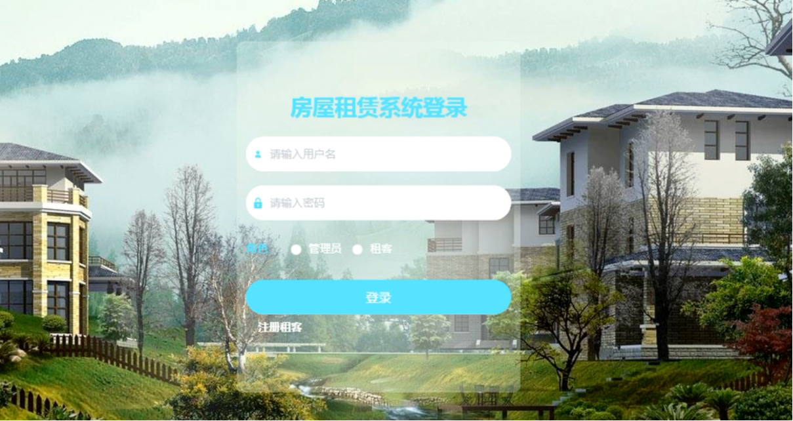

# springboot028-基于SpringBoot的房屋租赁系统

>  博主介绍：
>  Hey，我是程序员Chaers，一个专注于计算机领域的程序员
>  十年大厂程序员全栈开发‍ 日常分享项目经验 解决技术难题与技术推荐 承接各类网站设计，小程序开发，毕设等。
>  【计算机专业课程设计，毕业设计项目，Java，微信小程序，安卓APP都可以做，不仅仅是计算机专业，其它专业都可以】

## 本项目获取地址：https://www.bishecode.com/product/26/

## 3000套系统可挑选，获取链接：https://www.bishecode.com/

### 系统架构

> 前端：html | js | css | jquery | vue
>
> 后端：springboot | mybatis
> 
> 环境：jdk1.8+ | mysql | maven

# 一、内容包括
包括有  项目源码+项目论文+数据库源码+答辩ppt+远程调试成功

# 二、运行环境

> jdk版本：1.8 及以上； ide工具：IDEA； 数据库: mysql5.7及以上；编程语言: Java

# 三、需求分析

**3.1 可行性分析**

可行性分析目的是根据所开发系统的用户需求，明确研究方向和目标，通过可行性分析确定系统的框架和功能模块。

**3.1.1 技术可行性**

本房屋租赁系统采用Java和MYSQL数据库进行开发设计，作为计算机专业学生，在学校期间就接触到许多关于编程方面的知识，当然也包括各种编程软件，对他们的了解度也比较系统，所以技术开发上面还是有一定把握。

**3.1.2 经济可行性**

项目需要考虑花费问题，我们必须考虑系统开发中所有的花费进行计算，我们要考虑到系统需不需要太大的资金。二是系统开发后期维护相关的费用大不大。本系统采用我们开源的技术没进行设计，再设计中没有太多的花费，只需要一台电脑便可以进行开发，因此，该项目的实施在经济上完全可行。

**3.1.3 操作可行性**

本系统操作不复杂且比较容易上手，对于初次接触本系统的来说，不许要接受什么培训就可以操作本系统。用户不需要什么特定的软件，只需要安装大众所使用的浏览器即可进行系统的访问。本系统采用可视化窗口，面向大众，有效的避免了繁琐的操作。而且，本系统将各个功能都详细设计，各模块功能逻辑清晰，对用户非常友好。因此，本系统具有操作可行性。

**3.1.4 时间可行性**

从2020年11月份我们在学校就没有课程了，同学们大部分选择找工作实习了，我也是在其中。一边找工作的同时，一边忙着完成毕业设计工作。对于我本人来讲，目前的情况是白天我要上班参加实习工作，只有晚上我才有时间完成论文编写工作。论文答辩是在2021年5月份左右，将近半年时间来完成毕业设计，时间上还是很充分。
从上面几个部分的可行性分析得出，这次开发的基于Spring Boot的房屋租赁系统在开发上面没有什么大问题，值得开发。

**3.2 系统性能分析**

（1）系统的存储性：因为是房屋租赁系统，所以就会在数据库要求上比较严格，信息录入的比较多，而且丰富复杂， 这就需要一个强大的数据库来存放更多的数据和保证数据的时时性。

（2）系统的易学性：系统设计的应该简单易学的，设计的各种功能应该简单操作，不需要努力学习培训，缩短用户熟悉系统的进程。

（3）系统的数据要求：数据应该录入准确，需要更新时，数据应该可以及时的修改，数据还应该有独立保存，不能删除数据的时候会连带着把还需要的数据都删除掉。

（4）系统的有效性：页面响应时问应该在3秒以内，最长不能超过4秒;并支持至少10000人同时登录系统。

# 四、功能模块

系统结构设计是将一个庞大的任务细分为多个小的任务的过程，这些小的任务分段完成后，组合在一起形成一个完整的任务。在整个设计过程，以确定可能的具体方案达成每一个小的最终目标，对于每一个小的目标而言，我们必须先了解一些相关的需求分析的信息。然后对系统进行初步的设计，并对其逐渐进行优化，设计出一个具体可实现的系统结构。本基于Spring Boot的房屋租赁系统的功能结构设计如图

# 五、部分效果图展示

图5-1 系统主界面图【租客进入本系统可查看系统信息，包括首页公告信息以及房屋信息等，系统主界面展示如图】

图5-2 租客注册界面图【未有账号的租客可进入注册界面进行注册操作，租客注册界面展示如图】

图5-3 租客登录界面图【租客在登录界面可输入登录信息进行登录系统，租客登录界面展示如图】

图5-4 房屋详情界面图【租客可选择房屋查看房屋详情信息，登录可进行看房申请操作，房屋详情界面展示如图】

图5-5  看房申请界面图【租客登录后可选择房屋进行看房申请，看房申请界面展示如图】

图5-6租客管理界面图【管理员可查看、修改和删除租客信息，租客管理界面展示如图】

 <b>完整文章</b>

 

## 本项目获取地址：https://www.bishecode.com/product/26/

## 3000套系统可挑选，获取链接：https://www.bishecode.com/

